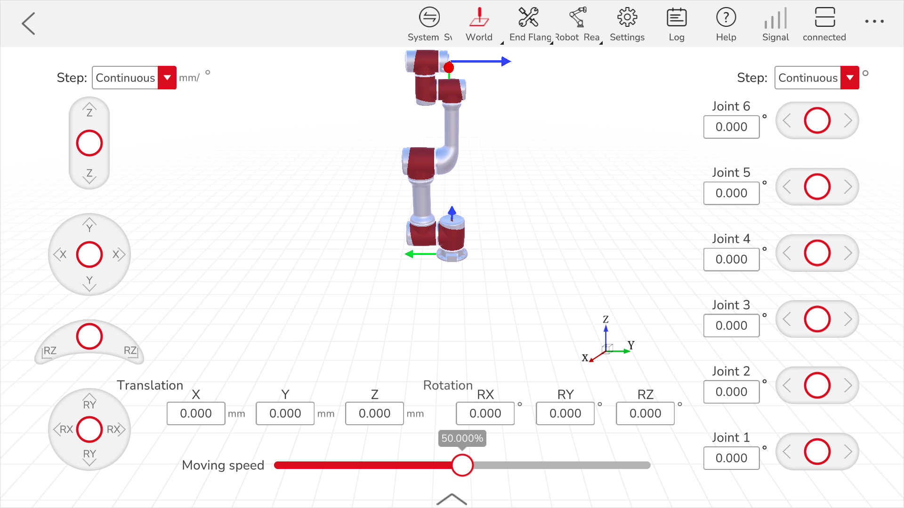
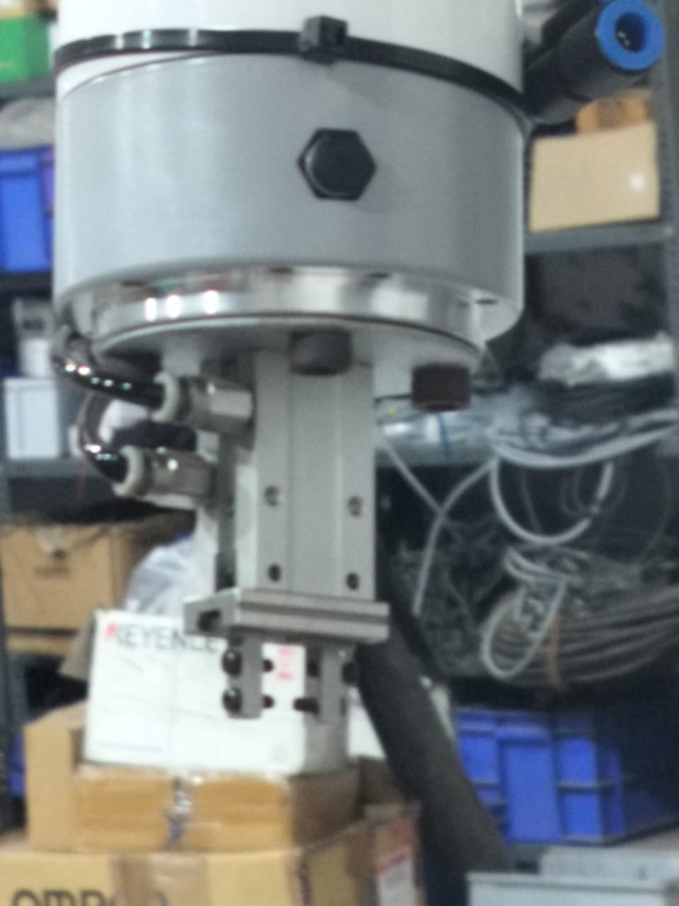
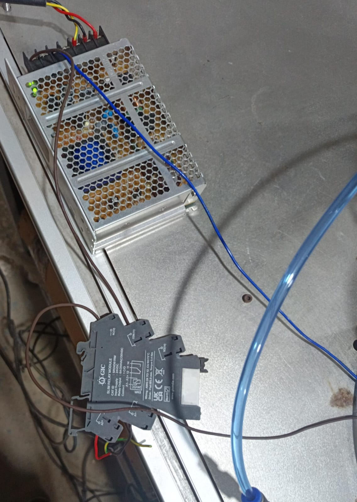

# JAKA MINICOBOT
This repository documents my industrial project on the Jaka MiniCobot, carried out during my internship at Acrobot Technologies.

The project focused on:

- **Pick and Place operations – designing and testing automated workflows**
- **Motion Studies – analyzing robot movement patterns and efficiency**
- **Joint Studies – studying individual and coordinated joint movements**
- **Coordinate Frame Experiments – working with user/world frames for precision tasks**
- **Gripper Control – integrating and testing end-effector operations**

The repository includes example code, configurations, and study notes for collaborative robotics applications.

## Introduction
Collaborative Robots (Cobots) are a new generation of robots designed to safely work alongside humans. Unlike traditional industrial robots, which are often caged for safety, cobots are lightweight, flexible, and equipped with advanced safety features that allow them to share workspaces with humans.  
Cobots are widely used in industries for tasks such as assembly, pick-and-place, quality inspection, and machine tending. Their main advantages include ease of programming, quick deployment, and adaptability to different tasks.  

This repository documents my **industrial project on the Jaka MiniCobot**, where I explored pick-and-place operations, motion and joint studies, coordinate systems, and gripper control.  

## 🤖 Jaka MiniCobot Overview  
The **Jaka MiniCobot** is a compact collaborative robot designed for precision tasks in small workspaces.  

**Key Specifications:**  
- **Degrees of Freedom (DOF):** 6  
- **Payload:** 1 kg  
- **Reach:** 580 mm  
- **Repeatability:** 0.1 mm 
- **Weight:** 9 kg  
- **Input voltage:** DC 30-60V

  

  

Applications include small parts assembly, electronics handling, laboratory automation, and education/training.  

## 🔩 Joints and link study

Robots are defined by their **joints** (which provide motion) and **links** (rigid parts that connect the joints).  
The Jaka MiniCobot is a **6-axis articulated robot arm**, which means:  
- It has **6 revolute joints (J1–J6)** → each joint provides **1 Degree of Freedom (DOF)**.  
- These joints are connected by **links** (rigid arm sections).  
- Together, the 6 joints and 6 links provide the robot with **6 DOF** — the ability to move its end-effector to any position and orientation in 3D space.
  
**DESCRIPTION :**
| Joint        | Range (°)     | Max Speed (°/s) |
|--------------|---------------|-----------------|
| J1           | -360 ~ +360   | 180             |
| J2           | -120 ~ +120   | 180             |
| J3           | -125 ~ +125   | 180             |
| J4           | -360 ~ +360   | 180             |
| J5           | -120 ~ +120   | 180             |
| J6           | -360 ~ +360   | 180             |
|Max TCP speed |      -        | 1.5 m/s         |

  

 

## 🔩 Motion Study  
The Jaka MiniCobot provides full 6-DOF control, enabling precise and flexible movements.  

- **Motion Study:** Different types of robot motions were tested to analyze trajectory accuracy, speed, and efficiency:  
  1. **Joint Interpolation (J-Move):** Each joint moves independently to its target angle. This allows faster movement for large joint rotations but may produce curved end-effector paths.  
  2. **Linear Interpolation (L-Move):** The end-effector moves along a straight line in Cartesian space from start to end. This ensures precise paths, ideal for pick-and-place and assembly tasks.  
  3. **Circular Interpolation (C-Move):** The end-effector moves along a defined arc or circle, useful for tasks like contour following or welding.  
- Each motion type was tested under different speeds and payloads to evaluate performance, smoothness, and repeatability.  
- Observations included minor deviations in path accuracy at higher speeds, emphasizing the trade-off between speed and precision.  
- These studies help determine the optimal motion planning method for specific tasks, balancing efficiency and accuracy.   

## 🖥️ Software & UI  
The Jaka MiniCobot is programmed and controlled using the **Jaka APP** interface.  

- Provides drag-and-drop style programming blocks  
- Allows teaching by demonstration (manually moving robot to positions)  
- Supports coordinate frame definition, trajectory planning, and gripper integration  

  

  

## 🖐️ Teaching Points to the Robot  

The Jaka MiniCobot allows defining positions (points) for tasks either through the **manual interface** or by **physically guiding the robot in Free Mode**. These points are essential for pick-and-place workflows, trajectory planning, and motion experiments.  

### 1. Manual Interface  
- Open the **Jaka APP** and go to the **point teaching** or **trajectory programming** section.  
- **Steps:**  
  1. Select the joint or Cartesian coordinate system for the point.  
  2. Enter the **X, Y, Z coordinates** and **orientation angles (Rx, Ry, Rz)** for the end-effector.  
  3. Save the point and repeat for all required positions.  
- This method is precise and useful for repetitive or pre-calculated positions.  

### 2. Free Mode (Hand-Guiding)  
- Press the **FREE (Drag) button** on the robot’s end tool flange to enter **drag teaching mode**.  
- Physically guide the robot arm to the desired position in 3D space.  
- Once the end-effector is in the correct location, press the **POINT (Record) button** to record the position in the operating software.  
- Repeat for all positions required for the task.  
- This method allows intuitive teaching of points without manually entering coordinates and is especially useful for tasks where exact values are difficult to calculate.

  

  

> ✅ **Tip:** You can combine both methods: teach complex positions by hand and fine-tune coordinates manually for higher precision.

## 📦 Pick and Place Operation  
One of the main tasks implemented was a **pick-and-place sequence**.  

**Steps:**  
1. Define the pick position (object location).  
2. Define the place position (target location).  
3. Program the trajectory using the Jaka APP.  
4. Execute with gripper integration.    

## 🌍 Coordinate Frames  
The project also explored **coordinate systems** in robot programming:  

- **Base Frame:** Default reference fixed at the robot base.  
- **Tool Frame:** Coordinate frame attached to the gripper/end-effector.  
- **User Frame:** Custom frame defined for easier programming in specific tasks.  

Experiments showed how defining a **user frame** allows easier movement planning relative to the workspace, making programming more efficient.  

## ✋ Gripper Control  
A **pneumatically actuated parallel jaw gripper** was used for handling small objects in this project.  

### Why Pneumatic Gripper?  
- Compared to an electric gripper, the **pneumatic type** was chosen for:  
  - **Faster actuation** and response time.  
  - **Consistent gripping force** across repeated cycles.  
  - **Simplicity and robustness** in setup and maintenance.  
- While electric grippers are more flexible (programmable gripping force and stroke), pneumatic grippers are lightweight and well-suited for repetitive industrial tasks where speed and reliability are prioritized.  

### Integration with Jaka MiniCobot  
- The pneumatic gripper was connected through the **MiniCobot’s tool IO interface** and actuated using a **valve system** controlled by the robot software.  
- The system consisted of:  
  1. **Solenoid Valve** → controlled the flow of compressed air to open/close the jaws.  
  2. **SMPC (Soft Motion Pneumatic Control) connection** → acted as the interface between the valve and robot control signals.  
  3. **Compressed Air Supply** → provided the necessary air pressure for actuation.  
- During pick-and-place operations, the robot sent a signal to the valve via the SMPC connection, which switched air flow and actuated the gripper.  

### Performance  
- Demonstrated reliable gripping, holding, and releasing of small objects in **pick-and-place tasks**.  
- The pneumatic setup provided **high repeatability**, with minimal delays between pick and release cycles.  
- Suitable for small-scale automation, laboratory handling, and educational demonstrations.  

  

  

### 🔌 Valve and SMPC Connection  
The pneumatic actuation required additional hardware for integration:  

- **Solenoid Valve:** Controlled the direction of airflow to open or close the jaws.  
- **SMPC Connection:** Interfaced between the Jaka MiniCobot control signals and the solenoid valve.  
- **Air Tubing & Fittings:** Connected the compressed air source to the valve and the gripper.  

 
    

  

> ✅ **Note:** Pneumatic grippers are ideal when speed and reliability are critical, while electric grippers are preferred when variable force control or delicate handling is required.

---

## 📊 Results & Learnings  
- Successfully implemented a **pick-and-place workflow**  
- Performed **motion and joint studies** to understand kinematics  
- Gained hands-on experience with **coordinate frames** in robotics  
- Integrated and tested **gripper operations**  

Through this project, I developed a strong understanding of collaborative robot operation, motion planning, and real-world application of robotic arms.  

## 🚀 Future Scope  
- Integration with a **vision system** for object detection and dynamic pick-and-place  
- Optimizing trajectory planning for speed and energy efficiency  
- Exploring advanced applications such as human-robot collaboration and machine tending  

## 📷 Media  
- [Video Demonstrations]([INSERT_LINK_HERE](https://drive.google.com/drive/folders/1717CqvTl4g32Phnu3x1bSRcFLLTB5wad?usp=sharing))  
- [Additional Images](INSERT_LINK_HERE)  

---

## 📌 Acknowledgment  
This project was completed during my internship at **Acrobot Technologies**, with guidance from the team on collaborative robotics and industrial automation.  
